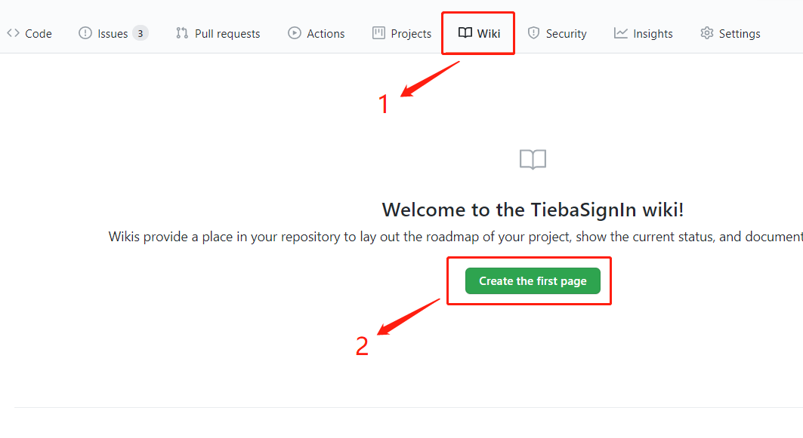
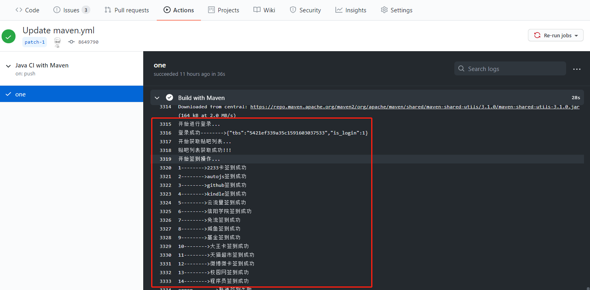

## 利用github actions贴吧自动签到


用的是手机端的接口，签到经验更多，用户只需要填写BDUSS即可，最多支持200个贴吧签到。

## 使用方法

## 1.fork本项目

## 2.获取BDUSS

在网页中登录上贴吧，然后按下f12打开调试模式，找到如下图的位置就是BDUSS


## 3.将BDUSS添加到仓库的Secrets中


多用户的格式如下，添加到上图的Value中。

```sh
第一个BDUSS&&第二个BDUSS
```

## 4.开启actions

默认actions是处于禁止的状态，需要手动开启。


## 5.第一次运行actions

可以自己提交一次push，或者新创建一个wiki都会触发第一次运行。





## 成功了

每天早上六点和下午六点将会进行签到，一次签到可能有的贴吧会签到失败。

## 2020-10-19

增加支持多账户签到，每个账号的BDUSS使用`&&`分割，具体格式如下。

```sh
第一个BDUSS&&第二个BDUSS
```
