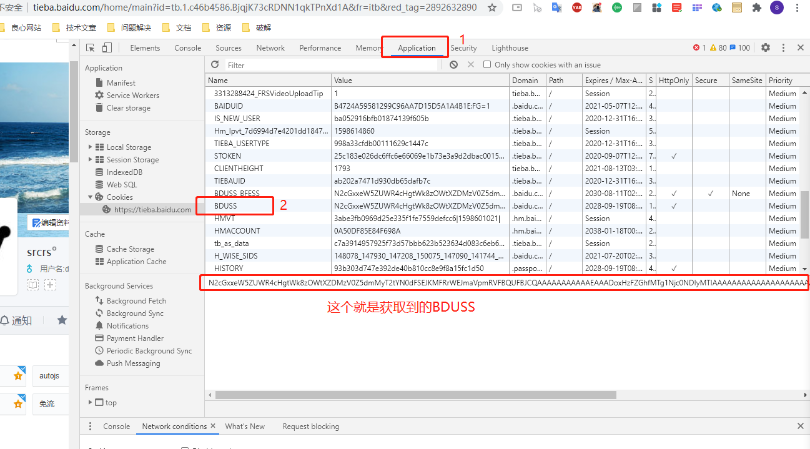
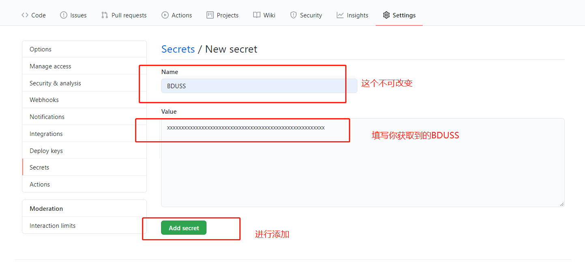
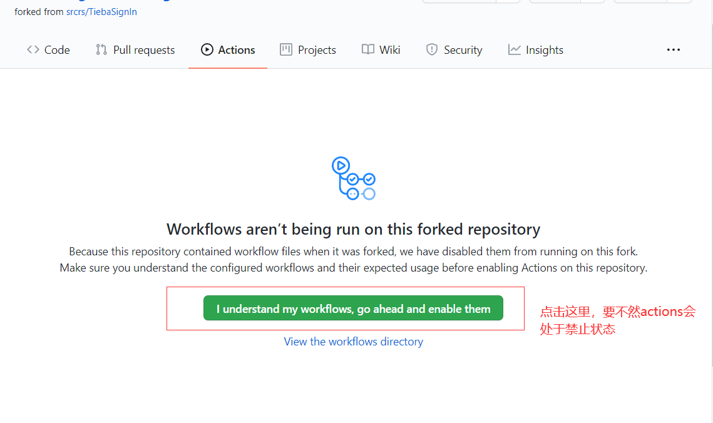

## 利用github actions贴吧自动签到

用的是手机端的接口，签到经验更多，用户只需要填写BDUSS即可，最多支持200个贴吧签到。

## 使用方法

## 1.fork本项目

## 2.获取BDUSS

在网页中登录上贴吧，然后按下f12打开调试模式，找到如下图的位置就是BDUSS

## 3.将BDUSS添加到仓库的Secrets中

## 4.开启actions

默认actions是处于禁止的状态，需要手动开启。

## 成功了

每天早上六点和下午六点将会进行签到，一次签到可能有的贴吧会签到失败。
